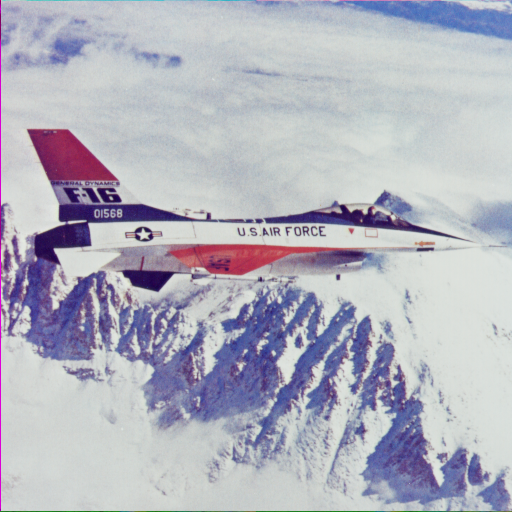

# Лабораторная работа №10

- [Лабораторная работа №10](#лабораторная-работа-10)
  - [Критерии оценивания работы](#критерии-оценивания-работы)
  - [Задания](#задания)
    - [Задание 1. Восстановление C-кода по ассемблеру — **30 баллов**](#задание-1-восстановление-c-кода-по-ассемблеру--30-баллов)
    - [Задание 2. Восстановление C-кода по ассемблеру — **40 баллов**](#задание-2-восстановление-c-кода-по-ассемблеру--40-баллов)
    - [Задание 3. Анализ исполняемых файлов и восстановление алгоритма проверки пароля — **60 баллов**](#задание-3-анализ-исполняемых-файлов-и-восстановление-алгоритма-проверки-пароля--60-баллов)
      - [Задание](#задание)
      - [Требуется](#требуется)
      - [Защита лабораторной работы](#защита-лабораторной-работы)
      - [Примечания](#примечания)
    - [Задание 4. Преобразование BMP формата RGB24 в grayscale с использованием SIMD — **120 баллов**](#задание-4-преобразование-bmp-формата-rgb24-в-grayscale-с-использованием-simd--120-баллов)
      - [Цель](#цель)
      - [Постановка задачи](#постановка-задачи)
      - [Примеры работы программы](#примеры-работы-программы)
      - [Формула преобразования](#формула-преобразования)
      - [Обязательная функция преобразования](#обязательная-функция-преобразования)
      - [Требования к реализации](#требования-к-реализации)
        - [1. Скалярная версия на C](#1-скалярная-версия-на-c)
        - [2. SIMD-версия](#2-simd-версия)
      - [Проверка корректности](#проверка-корректности)
      - [Измерение производительности](#измерение-производительности)
      - [Что нужно сдать](#что-нужно-сдать)
      - [Дополнительные вопросы для защиты](#дополнительные-вопросы-для-защиты)
    - [Задание 5. Alpha blending двух BMP RGB24 с использованием SIMD — **180 баллов**](#задание-5-alpha-blending-двух-bmp-rgb24-с-использованием-simd--180-баллов)
      - [Цель](#цель-1)
      - [Постановка задачи](#постановка-задачи-1)
      - [Примеры работы программы](#примеры-работы-программы-1)
      - [Формула alpha blending](#формула-alpha-blending)
      - [Преобразование sRGB → linear RGB](#преобразование-srgb--linear-rgb)
      - [Преобразование linear RGB → sRGB](#преобразование-linear-rgb--srgb)
      - [Обязательная функция смешивания](#обязательная-функция-смешивания)
      - [Требования](#требования)
      - [Что нужно сдать](#что-нужно-сдать-1)
      - [Вопросы для защиты](#вопросы-для-защиты)

## Критерии оценивания работы

- Для получения оценки "удовлетворительно" нужно набрать не менее 120 баллов.
- На оценку "хорошо" нужно набрать не менее 220 баллов.
- Для получения оценки "отлично" нужно набрать не менее 300 баллов.

## Задания

### Задание 1. Восстановление C-кода по ассемблеру — **30 баллов**

Ниже приведена функция на языке ассемблера x86-64 в синтаксисе Intel.

```asm
GUESS1:
        mov     eax, esi
.L2:
        test    edi, edi
        je      .L5
        xor     edx, edx
        div     edi
        mov     eax, edi
        mov     edi, edx
        jmp     .L2
.L5:
        test    eax, eax
        mov     edx, 1
        cmove   eax, edx
        ret
```

Предполагается, что функция использует соглашение о вызовах System V ABI.

Необходимо:

1. Определить, сколько аргументов принимает функция и в каких регистрах они передаются.
2. Определить, какие регистры используются для промежуточных вычислений.
3. Объяснить назначение цикла `.L2`.
4. Определить, какое значение возвращает функция.
5. Написать эквивалентную функцию на языке C.
6. Подобрать осмысленное имя для функции вместо `GUESS1`.

Дополнительный вопрос:

Почему перед инструкцией `div edi` выполняется команда:

```asm
xor edx, edx
```

Результатом выполнения задания должен быть C-код функции и краткое пояснение алгоритма.

### Задание 2. Восстановление C-кода по ассемблеру — **40 баллов**

Ниже приведена функция на языке ассемблера x86-64 в синтаксисе Intel.

```asm
GUESS2:
        mov     rax, rdi
        sar     rax, 32
        mov     rdx, rsi
        sar     rdx, 32
        add     eax, edx
        mov     edx, eax
        shr     edx, 31
        add     edx, eax
        add     edi, esi
        mov     eax, edi
        shr     eax, 31
        add     eax, edi
        sar     edx
        sal     rdx, 32
        sar     eax
        or      rax, rdx
        ret
```

Предполагается, что функция использует соглашение о вызовах System V ABI.

Необходимо:

1. Определить, сколько аргументов принимает функция и в каких регистрах они передаются.
2. Определить размер аргументов и возвращаемого значения.
3. Выяснить, как функция использует младшие и старшие 32 бита 64-битных аргументов.
4. Объяснить, зачем используются инструкции:

   - `sar rax, 32`
   - `sal rdx, 32`
   - `or rax, rdx`

5. Объяснить, какую роль играет последовательность:

   ```asm
   mov     edx, eax
   shr     edx, 31
   add     edx, eax
   sar     edx
   ```

6. Написать эквивалентную функцию на языке C.
7. Подобрать осмысленное имя для функции вместо `GUESS2`.

Подсказка:

Можно рассматривать 64-битное значение как пару 32-битных целых чисел:

Результатом выполнения задания должен быть C-код функции и краткое пояснение алгоритма.

### Задание 3. Анализ исполняемых файлов и восстановление алгоритма проверки пароля — **60 баллов**

Студентам предоставляется архив `crackme.7z` в формате 7zip, содержащий набор учебных программ:

```text
student_NNN.exe
student_NNN
```

где:

- `student_NNN.exe` — версия программы для ОС Windows;
- `student_NNN` — версия программы для Ubuntu 22.04 Linux.

Все программы скомпилированы для архитектуры **x86-64**.

Каждая программа при запуске запрашивает пароль. Для каждой программы используется собственный пароль.
При этом версии одной и той же программы для Windows и Linux используют одинаковый пароль.

#### Задание

Необходимо определить пароль для своей программы (**используйте свой порядковый номер в таблице студентов**)
без доступа к исходному коду.

Для решения задачи следует использовать инструменты анализа исполняемых файлов, например:

- дизассемблеры;
- декомпиляторы;
- отладчики;
- средства анализа машинного кода.

Допускается использование, например:

- Ghidra;
- IDA Free;
- x64dbg;
- gdb;
- radare2;
- objdump;
- Microsoft Visual Studio
- других аналогичных инструментов.

#### Требуется

1. Изучить работу предоставленной программы.
2. Определить алгоритм проверки пароля.
3. Восстановить корректный пароль для своей программы.
4. Подготовиться объяснить процесс решения задачи.

#### Защита лабораторной работы

Во время защиты студент должен:

- продемонстрировать найденный пароль;
- объяснить, каким образом был выполнен анализ программы;
- показать используемые инструменты и ключевые этапы исследования;
- при необходимости продемонстрировать часть процесса анализа в отладчике или дизассемблере.

#### Примечания

1. Программы являются учебными и специально подготовлены для анализа.
2. Использование brute force, перебора паролей или модификация бинарника не является основной целью задания.
3. Основная задача работы — изучение структуры исполняемых файлов и методов анализа машинного кода.

### Задание 4. Преобразование BMP формата RGB24 в grayscale с использованием SIMD — **120 баллов**

#### Цель

Научиться применять SIMD-инструкции SSE2/AVX для ускорения обработки массивов данных
на примере преобразования изображения в оттенки серого.

#### Постановка задачи

Написать программу `grayscalebmp`, которая принимает из командной строки два аргумента:

```bash
grayscalebmp input.bmp output.bmp
```

где:

- `input.bmp` — путь к входному BMP-файлу;
- `output.bmp` — путь к выходному BMP-файлу.

Программа должна загрузить изображение BMP в формате **RGB24**,
преобразовать его в grayscale и сохранить результат в новый BMP-файл.

Поддерживать достаточно только BMP-файлы:

- без сжатия;
- 24 bits per pixel;
- с пикселями в формате RGB/BGR, как они хранятся в BMP;
- с учётом выравнивания строк BMP по границе 4 байта.

#### Примеры работы программы

Исходное изображение:


Результирующее изображение:


#### Формула преобразования

Для каждого пикселя необходимо вычислить яркость по формуле:

$$
Y = 0.299 * R + 0.587 * G + 0.114 * B
$$

Затем установить все три компоненты пикселя равными `Y`:

```text
R = Y
G = Y
B = Y
```

Допускается использовать целочисленное приближение:

```c
Y = (77 * R + 150 * G + 29 * B) >> 8
```

Так как:

```text
77 / 256  ≈ 0.299
150 / 256 ≈ 0.586
29 / 256  ≈ 0.113
```

#### Обязательная функция преобразования

Необходимо реализовать функцию:

```c
void RGBToGrayscale(
    const uint8_t* srcPixels,
    unsigned width,
    unsigned height,
    unsigned stride,
    uint8_t* dstPixels
);
```

Параметры:

- `srcPixels` — указатель на пиксельные данные входного изображения;
- `width` — ширина изображения в пикселях;
- `height` — высота изображения в пикселях;
- `stride` — размер одной строки изображения в байтах с учётом BMP-выравнивания;
- `dstPixels` — указатель на пиксельные данные выходного изображения.

Функция должна пройти по всем пикселям изображения и записать grayscale-версию в `dstPixels`.

#### Требования к реализации

Необходимо реализовать две версии функции:

##### 1. Скалярная версия на C

```c
void RGBToGrayscale_C(
    const uint8_t* srcPixels,
    unsigned width,
    unsigned height,
    unsigned stride,
    uint8_t* dstPixels
);
```

Эта версия должна использовать обычный цикл по пикселям.

##### 2. SIMD-версия

Реализовать эквивалентную функцию:

```c
void RGBToGrayscale_SIMD(
    const uint8_t* srcPixels,
    unsigned width,
    unsigned height,
    unsigned stride,
    uint8_t* dstPixels
);
```

SIMD-версия должна использовать один из вариантов:

- ассемблер x86-64;
- SSE2 intrinsics;
- AVX/AVX2 intrinsics.

В SIMD-версии необходимо обрабатывать несколько пикселей за одну итерацию.

Также необходимо корректно обработать «хвост» строки,
если ширина изображения не кратна количеству пикселей, обрабатываемых SIMD-блоком.

#### Проверка корректности

Программа должна:

1. загрузить BMP-файл;
2. создать выходное изображение того же размера;
3. выполнить преобразование scalar-версией;
4. выполнить преобразование SIMD-версией;
5. убедиться, что результаты совпадают.

Допускается сравнивать выходные массивы байт побайтно.

Если результаты отличаются, программа должна вывести сообщение об ошибке.

#### Измерение производительности

Необходимо сравнить время работы двух функций:

- `RGBToGrayscale_C`;
- `RGBToGrayscale_SIMD`.

Для измерения рекомендуется использовать большое изображение, например: `8192 × 8192`.

Если исходного изображения такого размера нет, можно сгенерировать тестовое изображение программно.

Для более точного измерения необходимо выполнить преобразование несколько раз и взять среднее время.

Например:

```text
C version:    120 ms
SIMD version:  35 ms
Speedup:      3.4x
```

Для сравнения используйте Release-версию на языке C со включенными оптимизациями `/O2` или `/O3`.

#### Что нужно сдать

1. Исходный код программы.
2. Реализацию загрузки и сохранения BMP RGB24.
3. Скалярную функцию `RGBToGrayscale_C`.
4. SIMD-функцию `RGBToGrayscale_SIMD`.
5. Краткий отчёт:

   - какая SIMD-технология использована;
   - сколько пикселей обрабатывается за одну итерацию;
   - как обрабатывается хвост строки;
   - результаты замеров производительности;
   - вывод о полученном ускорении.

#### Дополнительные вопросы для защиты

1. Почему строки BMP выравниваются по 4 байта?
2. Почему нельзя просто считать, что размер строки равен `width * 3`?
3. Почему для grayscale используются разные коэффициенты для R, G и B?
4. Чем SIMD-версия отличается от скалярной?
5. Какой размер имеют XMM/YMM-регистры?
6. Почему нужно отдельно обрабатывать хвост строки?
7. Какие ограничения есть у SIMD-оптимизации в этой задаче?

### Задание 5. Alpha blending двух BMP RGB24 с использованием SIMD — **180 баллов**

#### Цель

Научиться применять SSE/AVX для ускорения обработки изображений.

#### Постановка задачи

Написать программу `blendbmp`, которая принимает аргументы командной строки:

```bash
blendbmp image1.bmp image2.bmp output.bmp alpha
```

где `alpha` — число от `0.0` до `1.0`.

Программа должна загрузить два BMP-изображения формата **RGB24**,
выполнить alpha blending и сохранить результат в выходной BMP-файл.

Изображения должны иметь одинаковые:

- ширину;
- высоту;
- формат пикселей.

Если размеры изображений не совпадают, программа должна вывести сообщение об ошибке.

#### Примеры работы программы

Исходные изображения:

 

Результат смешивания:


#### Формула alpha blending

Для каждого цветового канала результирующий цвет вычисляется по формуле:

```text
C = A * alpha + B * (1 - alpha)
```

Здесь A и B — цветовые компоненты пикселя первого и второго изображения.

Значения RGB в изображениях обычно хранятся в пространстве sRGB, где яркость кодируется нелинейно.
Из-за этого простое смешивание цветов напрямую в sRGB даёт визуально неправильный результат
— изображение получается слишком тёмным или слишком светлым.

Поэтому смешивание нужно выполнять не над sRGB-значениями напрямую, а в линейном цветовом пространстве.

Для этого перед alpha blending цвета сначала переводят в линейное цветовое пространство,
где значение пикселя пропорционально реальной интенсивности света.
После смешивания результат преобразуется обратно в sRGB для сохранения в изображение.

Именно так выполняется корректный alpha blending в графических приложениях и графических API.

#### Преобразование sRGB → linear RGB

Для нормализованного значения канала:

$$
C_{sRGB} = channel / 255.0
$$

используется формула:

- если $C_{sRGB}$ <= 0.04045:
  - $C_{linear} = C_{sRGB} / 12.92$
- иначе:
  - $C_{linear} = ((C_{sRGB} + 0.055) / 1.055) ^ {2.4}$

#### Преобразование linear RGB → sRGB

- если Clinear <= 0.0031308:
  - $C_{sRGB} = 12.92 * C_{linear}$
- иначе:
  - $C_{sRGB} = 1.055 * C_{linear} ^ {(1 / 2.4)} - 0.055$

Затем значение переводится обратно в диапазон `0..255`:

$$
channel = \lfloor C_{sRGB} * 255 \rfloor
$$

#### Обязательная функция смешивания

Необходимо реализовать две версии функции:

```c
void AlphaBlend_C(
    const uint8_t* srcA,
    const uint8_t* srcB,
    unsigned width,
    unsigned height,
    unsigned stride,
    float alpha,
    uint8_t* dst
);
```

```c
void AlphaBlend_SIMD(
    const uint8_t* srcA,
    const uint8_t* srcB,
    unsigned width,
    unsigned height,
    unsigned stride,
    float alpha,
    uint8_t* dst
);
```

SIMD-версия должна быть реализована одним из способов:

- на ассемблере x86-64;
- через SSE/AVX intrinsics.

#### Требования

Программа должна:

1. загрузить два BMP RGB24;
2. проверить совпадение размеров;
3. выполнить смешивание scalar-версией;
4. выполнить смешивание SIMD-версией;
5. сравнить результаты двух версий;
6. сохранить итоговое изображение;
7. измерить время работы обеих реализаций.

Для измерения производительности рекомендуется использовать большое изображение,
например `8192 × 8192`, и выполнять несколько итераций.

#### Что нужно сдать

- исходный код программы;
- реализацию чтения и записи BMP RGB24;
- функцию `AlphaBlend_C`;
- функцию `AlphaBlend_SIMD`;
- результаты сравнения производительности;
- краткий отчёт:

  - какая SIMD-технология использована;
  - сколько пикселей обрабатывается за одну итерацию;
  - как обработан хвост строки;
  - какое ускорение получено.

#### Вопросы для защиты

1. Почему строки BMP имеют `stride`, а не просто `width * 3`?
2. Почему SIMD-версии нужен отдельный код для хвоста строки?
3. Какие SIMD-регистры использовались?
4. Какие инструкции или intrinsics применялись?
5. Почему результаты C- и SIMD-версий могут немного отличаться при floating point вычислениях?
